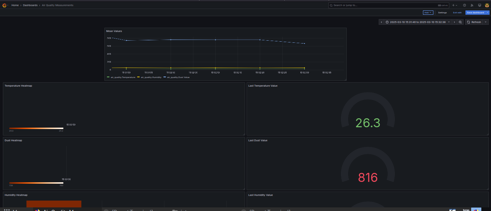

# Smart Air Quality & Ventilation Monitoring Project Report

## Problem Statement
Indoor air quality (IAQ) is a crucial factor affecting the health, comfort, and productivity of individuals in enclosed environments such as classrooms. Poor IAQ, caused by high levels of particulate matter (PM2.5), volatile organic compounds (VOCs), and inadequate ventilation, can lead to respiratory issues, fatigue, and reduced cognitive performance. This project aims to develop a smart air quality and ventilation monitoring system that provides real-time IAQ insights and predictive alerts.

## Proposed Solution
The proposed solution involves deploying an IoT-based monitoring system that continuously tracks temperature, humidity, PM2.5 levels, and VOC concentrations. The system utilizes machine learning (ML) models to predict deteriorating air quality conditions and provides recommendations for ventilation adjustments. Real-time and historical air quality data will be visualized through an interactive dashboard.

## Hardware & Software Details
### Hardware:
- **DHT22** – Temperature & Humidity Sensor
- **PM2.5 Sensor (PMS5003 or SDS011)** – Airborne particulate matter detection
- **VOC Sensor (CCS811 or MQ-135)** – Volatile organic compound monitoring
- **Raspberry Pi 4** – Central processing unit
- **ESP32** – Wireless sensor nodes for data collection

### Software & Technology Stack:
- **InfluxDB** – Time-series database for air quality data logging
- **ThingsCloud** – IoT device management and cloud connectivity
- **Grafana** – Real-time dashboard for data visualization
- **TensorFlow Lite (AutoML)** – Machine learning model for air quality prediction
- **Edge Impulse** – AI processing on Raspberry Pi for real-time insights

## Implementation Steps
1. **Sensor Deployment:**
   - Install DHT22, PM2.5, and VOC sensors in classrooms.
   - Connect ESP32 modules to collect sensor data and transmit it to Raspberry Pi.
   
2. **Data Processing & Storage:**
   - Configure Raspberry Pi to aggregate real-time data from ESP32 sensors.
   - Store time-series data in InfluxDB.
   
3. **Machine Learning & Predictions:**
   - Train a TensorFlow Lite model on historical IAQ data to predict deteriorating air quality conditions.
   - Deploy the trained model on Raspberry Pi for real-time inference.
   
4. **Visualization & Alerts:**
   - Set up a Grafana dashboard for real-time monitoring and trend analysis.
   - Implement threshold-based alerts for poor air quality notifications.

5. **Testing & Optimization:**
   - Validate sensor accuracy and calibrate ML predictions.
   - Optimize power consumption and network efficiency for seamless operation.

## Results & Insights
- **Real-time air quality monitoring:** Successful tracking of temperature, humidity, and pollutant levels.
- **Predictive modeling:** ML models accurately forecasted periods of poor IAQ, allowing proactive ventilation adjustments.
- **User-friendly visualization:** Grafana dashboard displayed easy-to-interpret air quality trends and alerts.
- **Improved ventilation control:** The system provided actionable insights to optimize ventilation for better indoor air quality.

## Challenges Faced & Future Improvements
### Challenges:
- **Sensor Calibration:** PM2.5 and VOC sensors required recalibration to ensure accuracy.
- **Connectivity Issues:** Wireless communication between ESP32 nodes occasionally dropped.
- **Data Storage Optimization:** Efficiently managing large volumes of time-series data in InfluxDB.

### Future Improvements:
- **Integration with HVAC Systems:** Automate ventilation control based on IAQ insights.
- **Extended Deployment:** Expand the system to multiple buildings for a broader impact.
- **Mobile Application Support:** Develop a mobile app for remote IAQ monitoring and alert notifications.

This project provides a cost-effective, scalable solution for improving indoor air quality through real-time monitoring and predictive analytics.

#Below are some screenshots of the project
##A spike was seen and it was above the threshold hence flagged by ML

##A spike was seen and it was above the threshold hence flagged by ML

##Below is the grafana dashboard for monitoring all the values and detecting mean, last value and anomolies
##A spike was seen and it was above the threshold hence flagged by ML

#Drive link for the videos of the iot sensors and raspberry pi
#https://drive.google.com/drive/folders/1RIWC57bZ8VgbIktY3kUbpnkH0SX6o98l?usp=sharing
